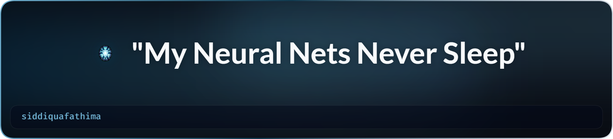

<!-- ========================================================= -->
<!--                  S I D D I Q U A  F A T H I M A           -->
<!-- ========================================================= -->

<div align="center">

<picture>
  <source media="(prefers-color-scheme: dark)" srcset="./art/header-dark.png">
  <source media="(prefers-color-scheme: light)" srcset="./art/header-light.png">
  
</picture>

<br><br>

# 👋 Hey there, I'm Siddiqua Fathima

### AI Engineer | GenAI & LLM Engineer

### 🚀 Building Intelligent AI Systems


<br>


</div>

---

# 🌸 About Me

<table>

<tr>

<td width="65%" valign="top">

I'm **Siddiqua Fathima**, an aspiring **AI Engineer** passionate about transforming innovative ideas into intelligent, production-ready applications.

I enjoy designing AI systems that combine **Large Language Models**, **Machine Learning**, **Computer Vision**, and **Backend Engineering** to solve practical problems.

### 💡 My Focus

- 🤖 Generative AI & Large Language Models
- 🧠 AI Agents & Agentic Workflows
- 📚 Retrieval-Augmented Generation (RAG)
- 👁️ Computer Vision
- ⚙️ FastAPI Backend Development
- 🗄️ Database Design
- 🐳 Docker & Deployment
- 🌍 Open Source Learning

### 🎯 Mission

To build reliable, scalable, and impactful AI applications that bridge research and real-world use.

> **"My Neural Nets Never Sleep."**

</td>

<td width="35%" align="center">


<br><br>


</td>

</tr>

</table>

---

# 🚀 AI Engineering Dashboard

<div align="center">

| 🤖 AI Engineering | 🧠 Generative AI | 👁️ Computer Vision | ⚙️ Backend |
|:-----------------:|:----------------:|:------------------:|:----------:|
| AI Agents | LLMs | OpenCV | FastAPI |
| RAG | LangChain | PyTorch | REST APIs |
| Prompt Engineering | LangGraph | TorchVision | PostgreSQL |
| Production AI | Gemini | Image Processing | Docker |

</div>

---

# 💻 Tech Stack

<div align="center">

### 👨‍💻 Languages


<br><br>

### 🤖 AI • Machine Learning


<br><br>

### ⚙️ Backend


<br><br>

### 🗄️ Database


<br><br>

### ☁️ DevOps & Tools


</div>

---

# 🌟 Core Expertise

<div align="center">

| Area | Focus |
|------|-------|
| 🤖 AI Engineering | Production AI Applications |
| 🧠 GenAI | LLMs • AI Agents • Prompt Engineering |
| 📚 RAG | LangChain • LangGraph • FAISS |
| 👁️ Computer Vision | PyTorch • OpenCV |
| ⚙️ Backend | FastAPI • REST APIs |
| 🗄️ Data | PostgreSQL • SQLAlchemy |
| 🚀 Deployment | Docker • Railway |

</div>

---

# 📌 Current Focus

```text
🧠 Designing AI Agents

████████████████████

🚀 Building LLM Applications

██████████████████

⚙️ Backend Engineering

████████████████

👁️ Computer Vision

███████████████

📚 Learning MLOps

███████████░░░░░
```

---

<div align="center">

### 💭 Philosophy

> **"Great AI isn't just about training better models. It's about building intelligent systems people can trust and use."**

</div>

---
<!-- ========================================================= -->
<!--                 🚀 FEATURED PROJECTS                      -->
<!-- ========================================================= -->

# 🚀 Featured AI Projects

<div align="center">

*"Engineering intelligent solutions with AI, Machine Learning, Computer Vision, and Generative AI."*

</div>

<br>

<table>

<tr>

<td width="50%" valign="top">

## 🧠 DermaAssist AI Agent

An intelligent dermatology assistant that combines **Computer Vision**, **LLMs**, and **Retrieval-Augmented Generation (RAG)** to support preliminary skin condition analysis.

### ✨ Highlights

- 🤖 Google Gemini-powered AI Assistant
- 📚 Retrieval-Augmented Generation (RAG)
- 🖼️ PyTorch Image Classification
- 🔍 FAISS Vector Search
- 🩺 AI-assisted dermatology guidance
- 💬 Conversational medical assistant

### 🛠️ Tech Stack

`Python` • `PyTorch` • `FastAPI` • `LangChain` • `LangGraph` • `Google Gemini` • `FAISS` • `Sentence Transformers`

<p align="center">

<a href="https://github.com/siddiquafathima/DermaAssist-AI-Agent">


</a>

</p>

</td>

<td width="50%" valign="top">

## 💬 Customer Feedback Insights Pipeline

A production-ready **GenAI analytics platform** that transforms customer feedback into structured business insights using Large Language Models.

### ✨ Highlights

- 🤖 LLM-powered sentiment analysis
- ⚠️ Urgency detection
- 📋 Structured JSON validation
- 🔄 Automatic retry mechanism
- 📊 Business analytics
- 🗄️ PostgreSQL integration

### 🛠️ Tech Stack

`Python` • `FastAPI` • `PostgreSQL` • `SQLAlchemy` • `Pydantic` • `NVIDIA NIM API`

<p align="center">

<a href="https://github.com/siddiquafathima/feedback-insights-pipeline">


</a>

</p>

</td>

</tr>

<tr>

<td width="50%" valign="top">

## 📈 AI Churn Revenue Optimization System

An end-to-end Machine Learning application that predicts customer churn and recommends business strategies to improve retention and revenue.

### ✨ Highlights

- 📊 Predictive Analytics
- 🤖 Machine Learning Models
- 📉 Churn Prediction
- 📈 Revenue Optimization
- ⚙️ Feature Engineering
- 📑 Explainable Insights

### 🛠️ Tech Stack

`Python` • `Scikit-learn` • `Pandas` • `NumPy` • `Matplotlib`

<p align="center">

<a href="https://github.com/siddiquafathima/AI-Churn-Revenue-Optimization">


</a>

</p>

</td>

<td width="50%" valign="top">

## 🚒 CrisisFlow AI Environment

A multi-agent emergency response simulation platform designed to model disaster scenarios and assist in intelligent decision-making.

### ✨ Highlights

- 🚨 Emergency simulations
- 🤖 Multi-agent AI workflows
- ⚡ Decision support engine
- 🧠 Intelligent automation
- 🌍 Real-world inspired scenarios

### 🛠️ Tech Stack

`Python` • `FastAPI` • `REST APIs` • `AI Agents`

<p align="center">

<a href="https://github.com/siddiquafathima/CrisisFlow">


</a>

</p>

</td>

</tr>

</table>

---

# 🏆 Achievements

<div align="center">

| 🏅 Achievement | Description |
|:--------------:|-------------|
| 🏆 IEEE Conference Publication | Published research on Machine Learning-based Cyberbullying Detection |
| 🚀 Meta PyTorch Hackathon | Built AI solutions using PyTorch |
| 🤖 AI Engineering Projects | Developed multiple end-to-end AI systems |
| 🌍 Open Source Journey | Learning through GitHub and OpenCV contributions |
| 🎓 MCA Specialization | Artificial Intelligence & Machine Learning |

</div>

---

# 🎖️ Certifications

<div align="center">

🏅 Google — Generative AI

🏅 Accenture North America — Data Analytics & Visualization

🏅 Women in Leadership

🏅 Forward Program

</div>

---

# 📈 GitHub Analytics

<div align="center">


</div>

<br>

<div align="center">


</div>

---

# 📊 Contribution Activity

<div align="center">


</div>

---

# 🌱 Currently Learning

<div align="center">

| 🔬 AI Research | ⚙️ Engineering |
|:--------------:|:--------------:|
| Multi-Agent AI | MLOps |
| Advanced RAG | Kubernetes |
| Vision-Language Models | Cloud Deployment |
| AI Safety | CI/CD |
| Distributed AI Systems | Scalable Infrastructure |

</div>

---

<div align="center">

### 💡 Engineering Philosophy

> **"I don't just train AI models—I engineer intelligent systems that are reliable, scalable, and built for real-world impact."**

</div>

---
<!-- ========================================================= -->
<!--                  🌍 LET'S CONNECT                         -->
<!-- ========================================================= -->

# 🤝 Let's Connect

<div align="center">

<p>
I enjoy collaborating on <b>AI Engineering</b>, <b>Generative AI</b>, <b>LLM Applications</b>,
<b>Computer Vision</b>, <b>Backend Development</b>, and <b>Open Source</b>.
</p>

<br>

<a href="https://www.linkedin.com/in/siddiqua-fathima-126b98212">

</a>

<a href="mailto:siddiquafathima3@gmail.com">

</a>

<a href="https://www.kaggle.com/siddiquafathima">

</a>

<a href="https://huggingface.co/siddiquafathima">

</a>

<a href="https://github.com/siddiquafathima">

</a>

</div>

---

# 💼 Open To

<div align="center">

| 💡 Looking For | ✅ Status |
|:--------------:|:---------:|
| AI Engineer Roles | 🟢 Open |
| GenAI / LLM Engineer Opportunities | 🟢 Open |
| Machine Learning Projects | 🟢 Open |
| Research Collaborations | 🟢 Open |
| Open Source Contributions | 🟢 Open |

</div>

---

# 💖 Support My Work

<div align="center">

If you like my work and find my projects useful,

⭐ **Star my repositories**

🍴 **Fork interesting projects**

🤝 **Let's collaborate**

💬 **Connect with me**

</div>

---
# 🐍 Contribution Snake


<p align="center">
  
</p>


---

# 🌱 Currently Exploring

<div align="center">

🧠 Agentic AI • 🤖 Large Language Models • 📚 Advanced RAG • 👁️ Vision-Language Models • ☁️ MLOps • 🚀 Cloud AI

</div>

---

# 💬 Fun Fact

<div align="center">

> **"My Neural Nets Never Sleep."**

I'm passionate about turning research ideas into production-ready AI systems that solve meaningful real-world problems.

</div>

---

# 📈 Visitor Counter

<div align="center">


</div>

---

# ❤️ Thanks for Visiting!

<div align="center">


<br><br>

### ⭐ If you enjoyed exploring my profile, consider starring a repository or connecting with me!

</div>

---

<div align="center">


</div>

<!-- ========================================================= -->
<!--                    END OF PROFILE README                  -->
<!-- ========================================================= -->
