<picture>
  <source media="(prefers-color-scheme: dark)" srcset="dark.svg">
  <source media="(prefers-color-scheme: light)" srcset="light.svg">
  
</picture>

  

 

 

## About Me

<table>
<tr>
<td width="65%" valign="top">

- 🎓 Final-year **MCA student** (2027 batch) at **Jain (Deemed-to-be University)**, Bengaluru
- 🧠 Building toward a career in **GenAI / LLM Engineering** — deep in RAG systems, LLM APIs, and agentic AI
- 🚀 Currently completing an **AI/ML internship at CodeTech IT Solutions**
- 🛠️ Shipped: a Customer Feedback Insights Pipeline (FastAPI + NVIDIA NIM) and a Real-Time Chat App (Node.js + Socket.io + Redis)
- 🎯 Targeting **GenAI/LLM Engineering, AI/ML Engineering, and Backend/Data Engineering** roles from August 2026
- 📍 Based in Bengaluru, India
- ✨ Always chasing the next model worth building

</td>
<td width="35%" align="center">

</td>
</tr>
</table>

 

## Tech Stack

 

## GitHub Analytics

 

## Contribution Snake

<!-- snake game starts -->

<!-- snake game ends -->

 

## Connect With Me

<!-- EDIT ME: replace [email protected] with your real email -->

 

